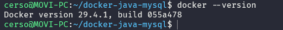
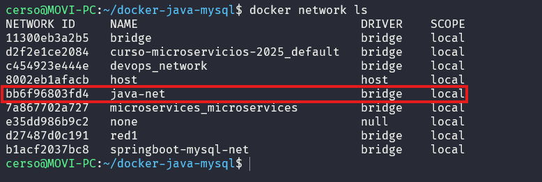
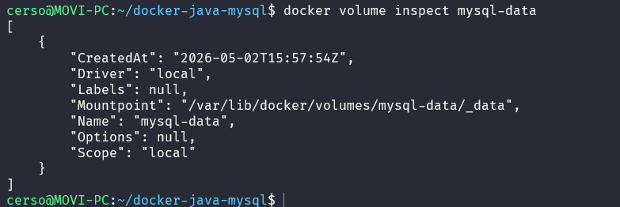
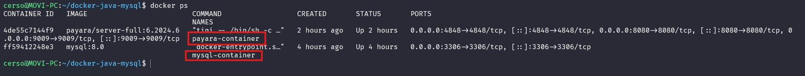
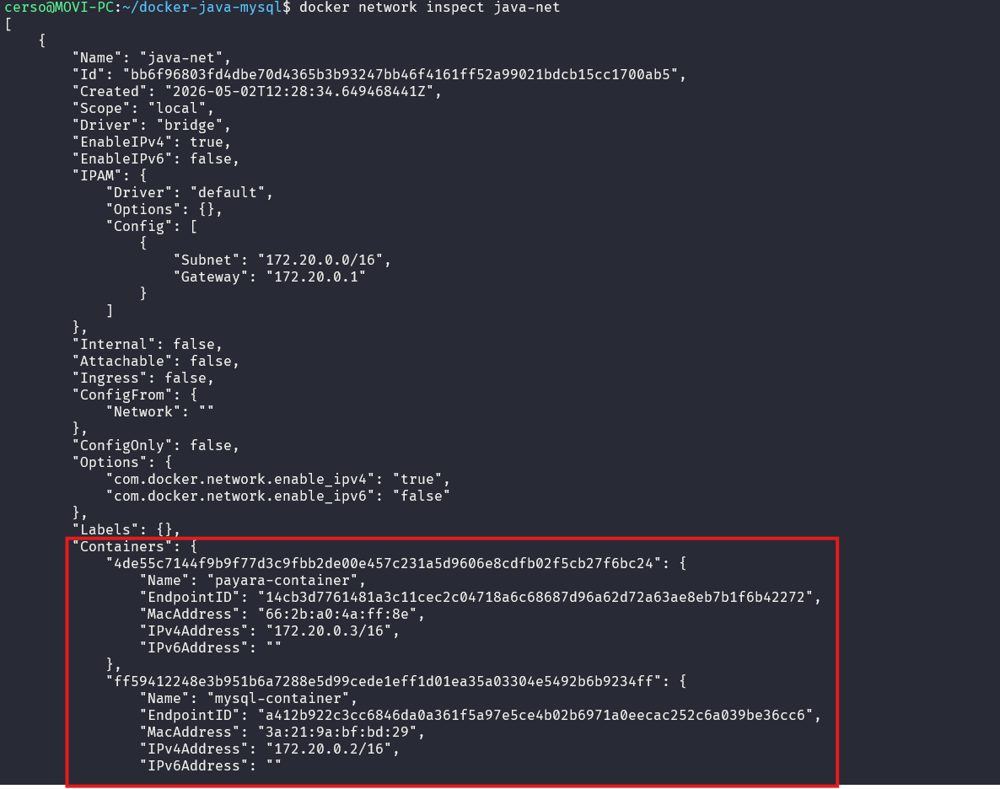

# TP Docker — MySQL + Java App Server
## Datos del alumno
- Nombre: Toribio Martin Rosendi
## 1. ¿Qué es Docker?
docker desktop es un programa que te permite correr contenedores que funcionan de una forma similar a una maquina virtual pero con un menor consumo de recursos y mas portatiles
## 2. Volúmenes en Docker
los volumenes en docker son son mecanismo de persistencia gestionado por el mismo docker, permitiendo que los datos sobrevivan al ciclo de vida del contenedor
## 3. Redes en Docker
docker gestiona la comunicacion entre contenedores mediante redes virtuales, si estan en la misma red se pueden comunicar utilizando sus hostnames gracias a la gestion de docker
## 4. ¿Por qué Payara Server?
se elige payara server por que es una distribucion de glassfish, soporta jakarta EE, incluye una consola de admin, imagenes de docker oficiales y actualizadas y finalmente escala bien el desarrollo sin cambiar stack tecnologico
## 5. Explicación del docker-compose.yml
es un archivo de configuracion que permite definir y ejecutar multpiples contenedores docker con un unico servicio coordinado
## 6. Explicación del init.sql
es un archivo sql que se inicializa automaticamente al iniciar una base de datos por primera vez
## 7. Dificultades y soluciones

# Capturas de Pantalla Obligatorias

## **Parte 1 — Infraestructura Docker (5 capturas)**

## 1. Salida de docker --version y docker info en la terminal

## 2. Salida de docker network ls mostrando la red java-net

## 3. Salida de docker volume inspect mysql-data

## 4. Salida de docker ps con ambos contenedores activos

## 5. docker network inspect java-net con ambos contenedores en la red

## **Parte 2 — MySQL (3 capturas)**
## 6. Logs de MySQL mostrando: ready for connections

## 7. Salida de SHOW DATABASES; mostrando la base appdb

## 8. Salida de SELECT * FROM usuarios; con los datos del init.sql

## **Parte 3 — Payara Admin Console / GUI (5 capturas)**
## 9. Pantalla de login de Admin Console en http://localhost:4848

## 10. Dashboard principal de Payara tras iniciar sesión

## 11. Pantalla del Connection Pool MySQLPool creado

## 12. Resultado del botón Ping mostrando conexión exitosa a MySQL

## 13. JDBC Resource jdbc/MySQLDS visible en la consola

## Parte 4 — Conectividad entre contenedores (1 captura)
## 14. Salida del ping de Payara hacia mysql-container desde la terminal

